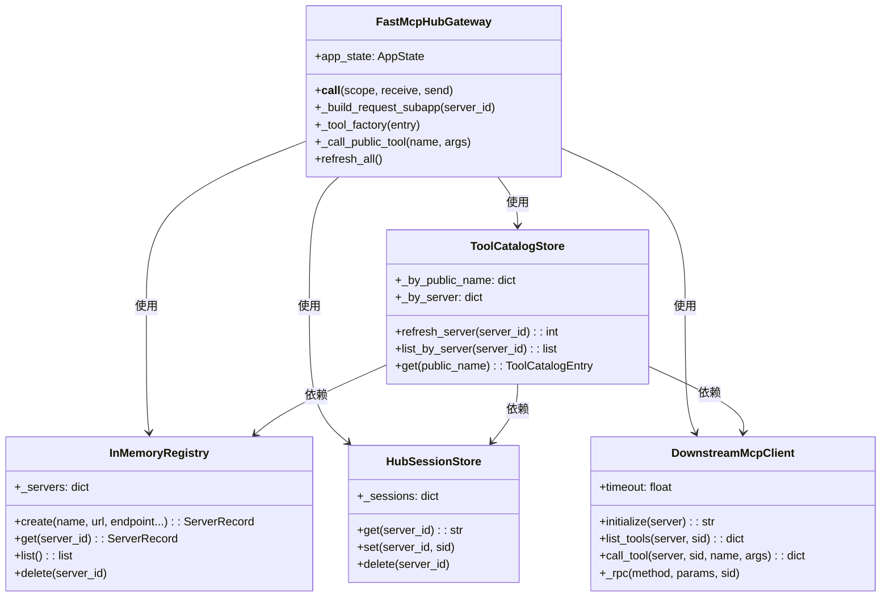
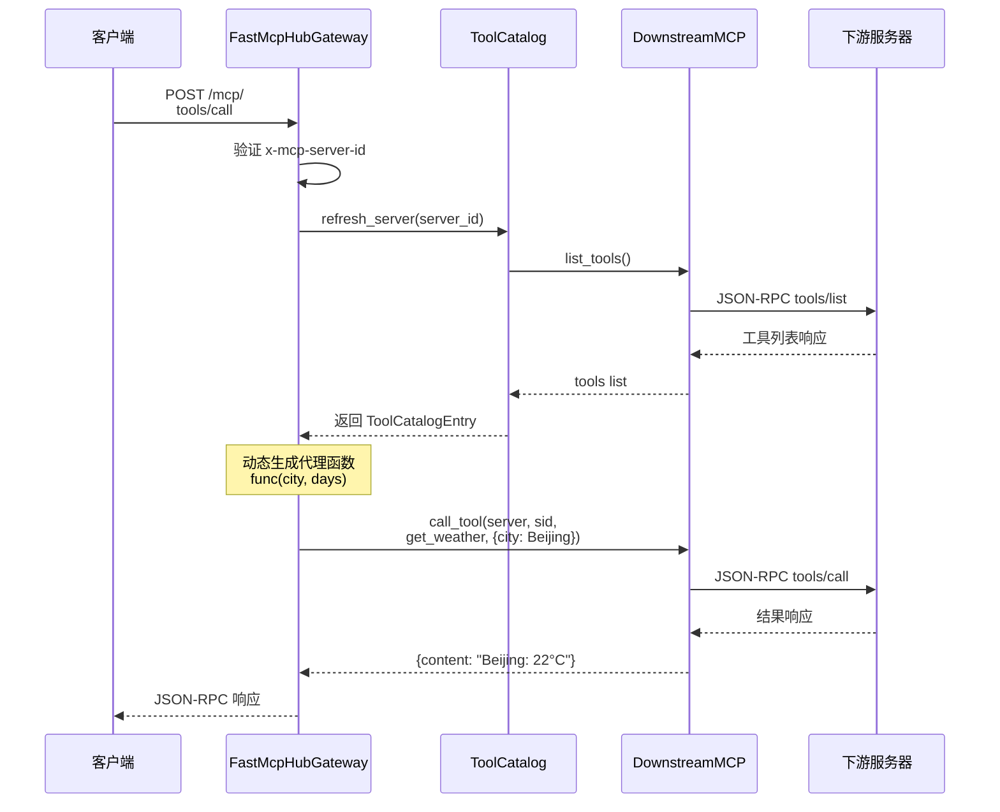
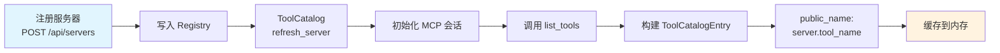
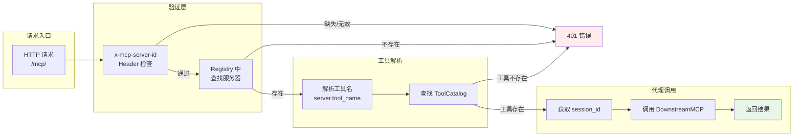

# Python MCP Hub 架构图

## 整体架构

> 为避免 GitHub Mermaid 渲染兼容问题，本节改为文本架构描述。

### 分层结构

1. **用户端**
   - MCP Client 发起 `POST /mcp` 请求
   - Header 携带 `x-mcp-server-id`

2. **Hub 网关层**
   - `FastMcpHubGateway`：统一入口
   - Header 校验：验证 `x-mcp-server-id`
   - Tool Proxy Factory：动态生成工具代理

3. **工具目录层**
   - `InMemoryRegistry`：服务器注册信息
   - `ToolCatalogStore`：工具目录缓存
   - `HubSessionStore`：MCP 会话 ID 缓存

4. **下游通信层**
   - `DownstreamMcpClient`：下游调用客户端
   - `MCP JSON-RPC`：协议封装
   - `SSE/JSON Parser`：响应解析

5. **下游服务器层**
   - `weather-demo /mcp`
   - 其他 MCP 服务器

### 请求流向

```text
MCP Client
  -> FastMcpHubGateway (/mcp)
  -> Header 验证 (x-mcp-server-id)
  -> InMemoryRegistry 查询 server
  -> ToolCatalogStore 刷新/读取工具目录
  -> Tool Proxy Factory 生成代理函数
  -> DownstreamMcpClient
  -> MCP JSON-RPC (initialize/list_tools/call_tool)
  -> Downstream MCP Server
  -> SSE/JSON 响应
  -> 返回给 MCP Client
```

## 组件关系图



## 数据流图



## 工具注册与发现流程



## 请求路由图



## 文件结构可视化

```
myagent/
├── app/
│   ├── api/
│   │   └── routes_servers.py      📡 REST API 路由
│   │
│   ├── core/
│   │   ├── registry.py            🗂️ 服务器注册表
│   │   ├── session_store.py       🔑 MCP 会话 ID 缓存
│   │   ├── downstream_mcp_client.py 🌐 下游 MCP 客户端
│   │   ├── tool_catalog.py        📋 工具目录缓存
│   │   ├── models.py              📝 Pydantic 数据模型
│   │   └── errors.py              ⚠️ 错误定义
│   │
│   ├── mcp/
│   │   └── fastmcp_hub.py         🚪 ASGI 网关入口
│   │
│   └── main.py                    ⚡ FastAPI 主应用
│
├── demo/
│   └── weather_server.py          🌤️ Weather Demo 服务器
│
└── examples/
    ├── sdk_client.py              🛠️ SDK 使用示例
    └── mcpservers_client.py       📦 MCP Config 使用示例
```

**关键点**：
- 🟢 **Gateway**: 统一入口，路由所有 MCP 请求
- 🔵 **Catalog**: 工具缓存，避免频繁查询下游
- 🟡 **Client**: 协议转换，HTTP ↔ MCP
- 🟣 **Registry**: 服务器配置持久化
