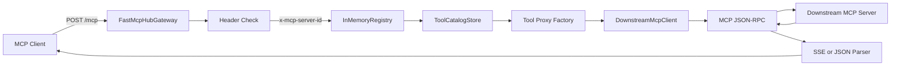

# Python MCP Hub 架构图

## 整体架构



## 组件关系图

```mermaid
classDiagram
    class FastMcpHubGateway {
        +app_state: AppState
        +__call__(scope, receive, send)
        +_build_request_subapp(server_id)
        +_tool_factory(entry)
        +_call_public_tool(name, args)
        +refresh_all()
    }

    class ToolCatalogStore {
        +_by_public_name: dict
        +_by_server: dict
        +refresh_server(server_id): int
        +list_by_server(server_id): list
        +get(public_name): ToolCatalogEntry
    }

    class DownstreamMcpClient {
        +timeout: float
        +initialize(server): str
        +list_tools(server, sid): dict
        +call_tool(server, sid, name, args): dict
        +_rpc(method, params, sid)
    }

    class HubSessionStore {
        +_sessions: dict
        +get(server_id): str
        +set(server_id, sid)
        +delete(server_id)
    }

    class InMemoryRegistry {
        +_servers: dict
        +create(name, url, endpoint...): ServerRecord
        +get(server_id): ServerRecord
        +list(): list
        +delete(server_id)
    }

    FastMcpHubGateway --> ToolCatalogStore: 使用
    FastMcpHubGateway --> DownstreamMcpClient: 使用
    FastMcpHubGateway --> HubSessionStore: 使用
    FastMcpHubGateway --> InMemoryRegistry: 使用
    ToolCatalogStore --> InMemoryRegistry: 依赖
    ToolCatalogStore --> HubSessionStore: 依赖
    ToolCatalogStore --> DownstreamMcpClient: 依赖
```



## 数据流图

```mermaid
sequenceDiagram
    participant C as 客户端
    participant G as FastMcpHubGateway
    participant T as ToolCatalog
    participant D as DownstreamMCP
    participant S as 下游服务器

    C->>G: POST /mcp/<br/>tools/call
    G->>G: 验证 x-mcp-server-id
    G->>T: refresh_server(server_id)
    T->>D: list_tools()
    D->>S: JSON-RPC tools/list
    S-->>D: 工具列表响应
    D-->>T: tools list
    T-->>G: 返回 ToolCatalogEntry

    Note over G: 动态生成代理函数<br/>func(city, days)

    G->>D: call_tool(server, sid,<br/>get_weather, {city: Beijing})
    D->>S: JSON-RPC tools/call
    S-->>D: 结果响应
    D-->>G: {content: "Beijing: 22°C"}
    G-->>C: JSON-RPC 响应
```



## 工具注册与发现流程

```mermaid
flowchart LR
    A[注册服务器<br/>POST /api/servers] --> B[写入 Registry]
    B --> C[ToolCatalog<br/>refresh_server]
    C --> D[初始化 MCP 会话]
    D --> E[调用 list_tools]
    E --> F[构建 ToolCatalogEntry]
    F --> G[public_name:<br/>server.tool_name]
    G --> H[缓存到内存]

    style A fill:#e1f5fe
    style H fill:#fff3e0
```



## 请求路由图

```mermaid
graph LR
    subgraph 请求入口
        Req[HTTP 请求<br/>/mcp/]
    end

    subgraph 验证层
        Check1[x-mcp-server-id<br/>Header 检查]
        Check2[Registry 中<br/>查找服务器]
    end

    subgraph 工具解析
        Parse1[解析工具名<br/>server.tool_name]
        Parse2[查找 ToolCatalog]
    end

    subgraph 代理调用
        Proxy1[获取 session_id]
        Proxy2[调用 DownstreamMCP]
        Proxy3[返回结果]
    end

    Req --> Check1
    Check1 -->|"缺失/无效"| Error[401 错误]
    Check1 -->|"通过"| Check2
    Check2 -->|"不存在"| Error
    Check2 -->|"存在"| Parse1
    Parse1 --> Parse2
    Parse2 -->|"工具不存在"| Error
    Parse2 -->|"工具存在"| Proxy1
    Proxy1 --> Proxy2
    Proxy2 --> Proxy3

    style Error fill:#ffebee
    style Proxy3 fill:#e8f5e9
```

## 文件结构可视化

```
myagent/
├── app/
│   ├── api/
│   │   └── routes_servers.py      📡 REST API 路由
│   │
│   ├── core/
│   │   ├── registry.py            🗂️ 服务器注册表
│   │   ├── session_store.py       🔑 MCP 会话 ID 缓存
│   │   ├── downstream_mcp_client.py 🌐 下游 MCP 客户端
│   │   ├── tool_catalog.py        📋 工具目录缓存
│   │   ├── models.py              📝 Pydantic 数据模型
│   │   └── errors.py              ⚠️ 错误定义
│   │
│   ├── mcp/
│   │   └── fastmcp_hub.py         🚪 ASGI 网关入口
│   │
│   └── main.py                    ⚡ FastAPI 主应用
│
├── demo/
│   └── weather_server.py          🌤️ Weather Demo 服务器
│
└── examples/
    ├── sdk_client.py              🛠️ SDK 使用示例
    └── mcpservers_client.py       📦 MCP Config 使用示例
```

**关键点**：
- 🟢 **Gateway**: 统一入口，路由所有 MCP 请求
- 🔵 **Catalog**: 工具缓存，避免频繁查询下游
- 🟡 **Client**: 协议转换，HTTP ↔ MCP
- 🟣 **Registry**: 服务器配置持久化
