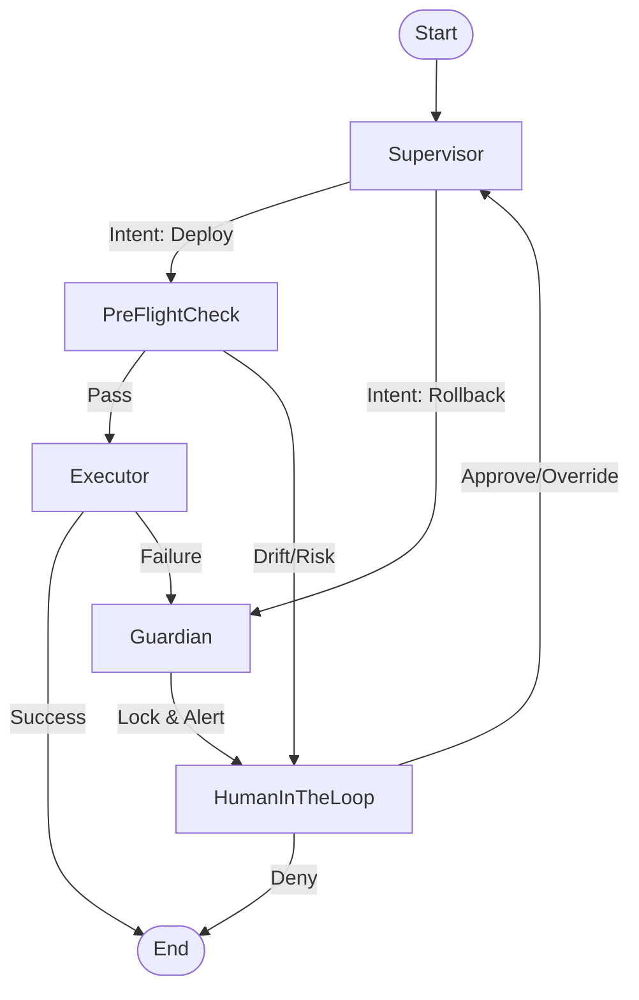

# SRE Agent Architecture with LangGraph

**Created**: 2026-02-05
**Context**: Designing a stateful, human-in-the-loop SRE Guardian using LangGraph.

## 1. Core State Schema (状态定义)
The agent maintains a persistent state object throughout its lifecycle.

```python
from typing import TypedDict, Optional, Literal

class AgentState(TypedDict):
    # Context
    user_intent: Literal["deploy", "rollback", "diagnose"]
    target_version: str
    
    # Execution State
    current_batch: int
    batch_status: Literal["pending", "running", "success", "failed"]
    
    # Safety Guards
    global_lock: bool         # Circuit breaker active?
    drift_detected: bool      # Config drift found?
    blocking_resource: Optional[str] # Resource causing deadlock (e.g. lease)
    
    # Human Interaction
    human_feedback: Optional[str] # "approve", "deny", "override"
```

---

## 2. Graph Architecture (节点架构)

The architecture is designed as a **State Machine** with explicit interception points.

### Nodes (核心节点)
1.  **`Supervisor`**: The brain. Routes requests based on intent and global lock status.
2.  **`PreFlightCheck`**: The scanner. Checks K8s cluster health, config drift, and existing locks.
3.  **`Executor`**: The worker. Calls K8s API to apply changes.
4.  **`Guardian`**: The interceptor. Catches failures from Executor, activates Global Lock, and formulates recovery plans.
5.  **`HumanInTheLoop`**: The gate. A virtual node representing a graph interruption (`interrupt_before`).

### Workflow Diagram (Mermaid)



---

## 3. Implementation Skeleton (代码骨架)

```python
from langgraph.graph import StateGraph, END
from typing import Literal

# Conditional Edges Logic
def check_risk(state: AgentState) -> Literal["safe", "risky"]:
    if state["drift_detected"] or state["global_lock"]:
        return "risky"
    return "safe"

def check_status(state: AgentState) -> Literal["success", "failure"]:
    if state["batch_status"] == "failed":
        return "failure"
    return "success"

# 1. Initialize Graph
workflow = StateGraph(AgentState)

# 2. Add Nodes
workflow.add_node("supervisor", supervisor_node)
workflow.add_node("pre_flight", pre_flight_node)
workflow.add_node("executor", executor_node)
workflow.add_node("guardian", guardian_node)
# Human node is implicit via interrupt_before

# 3. Add Edges
workflow.set_entry_point("supervisor")

workflow.add_edge("supervisor", "pre_flight")

workflow.add_conditional_edges(
    "pre_flight",
    check_risk,
    {
        "safe": "executor",
        "risky": "guardian" # Route risky states to Guardian/Human
    }
)

workflow.add_conditional_edges(
    "executor",
    check_status,
    {
        "success": END,
        "failure": "guardian"
    }
)

# Guardian always leads to Human intervention (Interrupt)
workflow.add_edge("guardian", "supervisor") 

# 4. Compile with Persistence & Interrupts
app = workflow.compile(
    checkpointer=memory,
    interrupt_after=["guardian"] # Pause after Guardian runs to wait for Human
)
```

## 4. Key Behaviors (关键行为)

### A. The "Interrupt" Mechanism
When the graph hits `interrupt_after=["guardian"]`, it **suspends execution**.
*   The Agent saves state to the database (Checkpoint).
*   The user receives an alert: *"Deployment Failed. Lock Active. Reply 'ROLLBACK' to recover."*
*   The graph **resumes** only when the user provides new input.

### B. State Recovery (Time Travel)
If the user manually fixes a lock in the cluster, they can tell the Agent "Retry". The Agent reloads the state from the Checkpoint, re-runs `PreFlightCheck`, sees the lock is gone, and proceeds safely.
